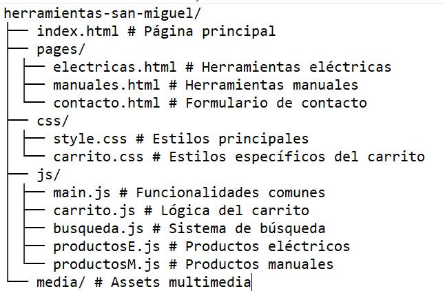

# Herramientas "San Miguel" - E-commerce de Ferretería


Sitio web e-commerce especializado en la venta de herramientas eléctricas y manuales, con carrito de compras funcional y formularios de contacto.

## Características principales

- 🛒 **Carrito de compras interactivo** con persistencia en localStorage
- 🔍 **Sistema de búsqueda** en menú y productos
- 📝 **Formulario de contacto** con validación en tiempo real
- 📱 **Diseño responsive** adaptable a móviles y tablets
- 💳 **Simulación de proceso de pago** con confirmación visual
- ✉️ **Suscripción a newsletter** integrado con Formspree

## Tecnologías utilizadas

- Frontend:
  - HTML5 semántico
  - CSS3 con variables y Flexbox/Grid
  - JavaScript ES6+
- APIs:
  - **[JSONBin.io](https://jsonbin.io/)** - Almacenamiento de datos de productos
  - [Formspree](https://formspree.io/) - Procesamiento de formularios
- Librerías:
  - [Font Awesome](https://fontawesome.com/) - Iconos
  - [Google Fonts](https://fonts.google.com/) - Tipografía Orbitron

## Estructura del proyecto




## Configuración de la API JSONBin

El proyecto utiliza una API propia en [JSONBin.io](https://jsonbin.io/) para almacenar los datos de productos. La estructura utilizada es:

Endpoint actual:
https://api.jsonbin.io/v3/b/68847e1dae596e708fbbf4a6/latest

```json
[
  {
    "id": 1,
    "title": "Taladro Percutor 750W",
    "price": 249.99,
    "image": "url-de-la-imagen.jpg",
    "category": "eléctrica"
  },
  ...
]


